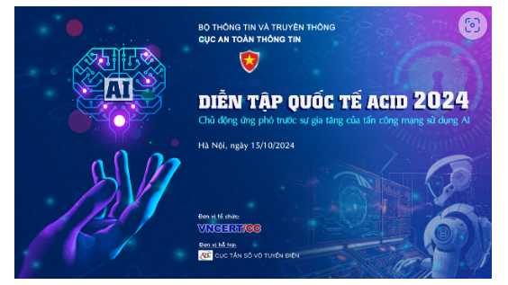

DIỄN TẬP QUỐC TẾ ACID 2024

Diễn tập quốc tế ACID là diễn tập thường niên của 10 CERT quốc gia khu vực Đông Nam Á và 5 quốc gia đối thoại gồm Ấn Độ, Hàn Quốc, Nhật Bản, Trung Quốc, và Úc về phối hợp trong hoạt động ứng cứu, tăng cường năng lực xử lý sự cố an toàn thông tin. Với mục tiêu chung của khu vực là cập nhật các xu hướng an toàn thông tin mới nhất nhằm tăng cường sự sẵn sàng và chủ động ứng cứu sự cố của các quốc gia trong khu vực, thúc đẩy năng lực kỹ thuật của thành viên các đội ứng cứu sự cố, diễn tập ACID năm 2024 sẽ đề cập đến xu hướng ứng dụng trí tuệ nhân tạo AI trong nhiều ngành, nhiều lĩnh vực, kể cả việc lạm dụng AI cho các mục đích xấu. Chủ đề diễn tập quốc tế ACID năm nay là “Chủ động ứng phó trước sự gia tăng của tấn công mạng sử dụng AI”.

Tiếp nối diễn tập quốc tế APCERT của CERT các quốc gia khu vực Châu Á Thái Bình Dương đã triển khai trong tháng 8/2024, Cục An toàn thông tin – Bộ Thông tin và Truyền thông tiếp tục triển khai diễn tập ACID cho các thành viên Mạng lưới ứng cứu sự cố an toàn thông tin mạng quốc gia (gọi tắt là Mạng lưới) gồm các Bộ, ngành và cơ quan trung ương, các cơ quan hạ tầng thông tin trọng yếu và các hệ thống thông tin quan trọng quốc gia, các tỉnh, thành phố, các nhà cung cấp viễn thông – Internet, và các doanh nghiệp và tổ chức An toàn thông tin tham gia.

Đây là một chương trình quan trọng nhằm nâng cao, đảm bảo an toàn và ổn định không gian mạng quốc gia. Qua diễn tập, các thành viên Mạng lưới không chỉ đánh giá được năng lực hiện tại trong nước mà còn xác định những xu hướng tấn công mới, học hỏi từ các tổ chức quốc tế, từ đó xây dựng các kịch bản huấn luyện thực tế hơn, giúp các đội ứng cứu sẵn sàng đối mặt với tình huống mới, đa dạng, chưa có tiền lệ. Đồng thời, diễn tập cũng góp phần nâng cao nhận thức của cộng đồng, các nhà lãnh đạo, các doanh nghiệp về tầm quan trọng của an toàn thông tin, tạo sự đồng thuận trong việc bảo vệ dữ liệu, tài sản số quốc gia. Ngoài ra, việc triển khai lại diễn tập quốc tế ACID cho các cơ quan đơn vị thuộc Mạng lưới là cơ hội giúp các tổ chức trong nước tiếp tục học hỏi, nâng cao kỹ năng, năng lực ứng phó sự cố và tiếp cận với các diễn tập về an toàn thông tin trong khu vực.

Diễn tập ACID năm nay có 2 phiên gồm phiên kỹ thuật ngày 15/10 và phiên diễn tập bàn tròn buổi sáng ngày 16/10. Trung tâm Ứng cứu khẩn cấp không gian mạng Việt Nam (VNCERT/CC) thuộc Cục An toàn thông tin sẽ đại diện Việt Nam tham gia trực tuyến với các đội quốc tế. Bên cạnh đó, VNCERT/CC sẽ triển khai phiên diễn tập kỹ thuật cho tất cả các đơn vị thành viên Mạng lưới theo hình thức trực tiếp tại Hà Nội, kết hợp kết nối trực tuyến cho các đơn vị tham dự ở xa từ 8g30 đến 16g00 ngày 15/10/2024.