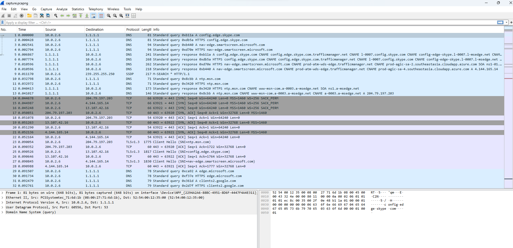
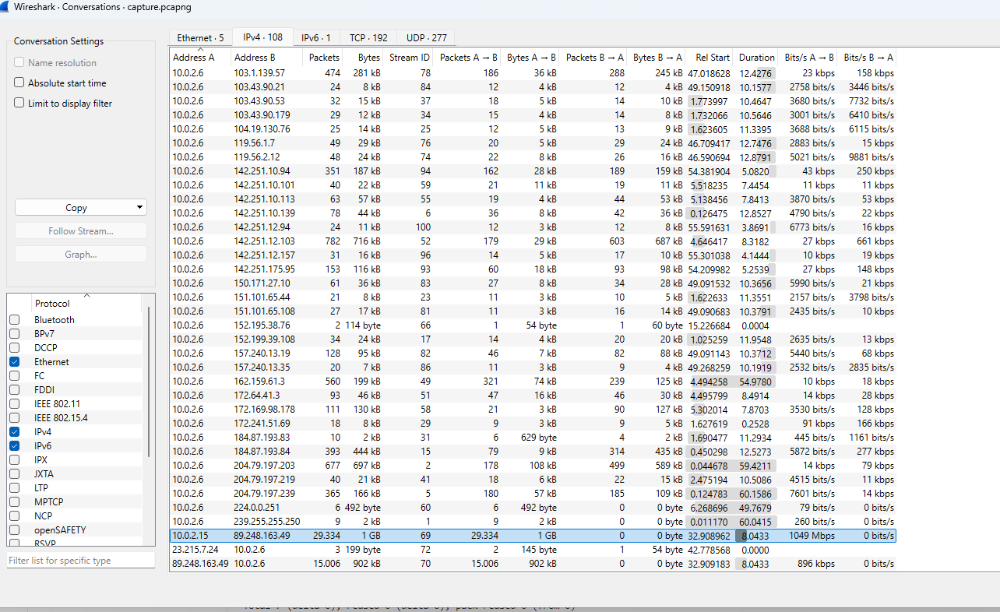
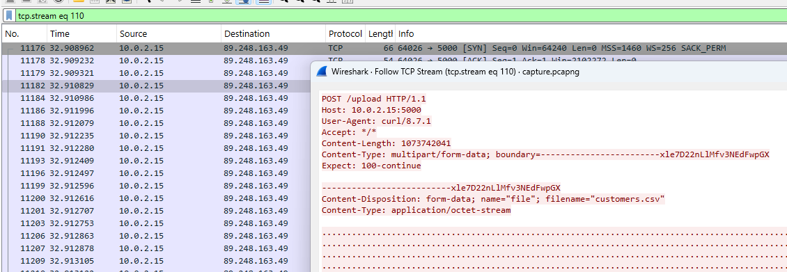
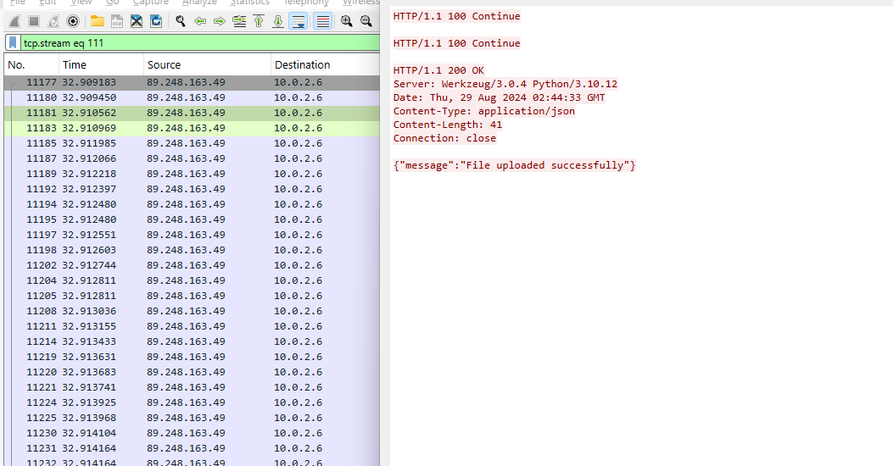
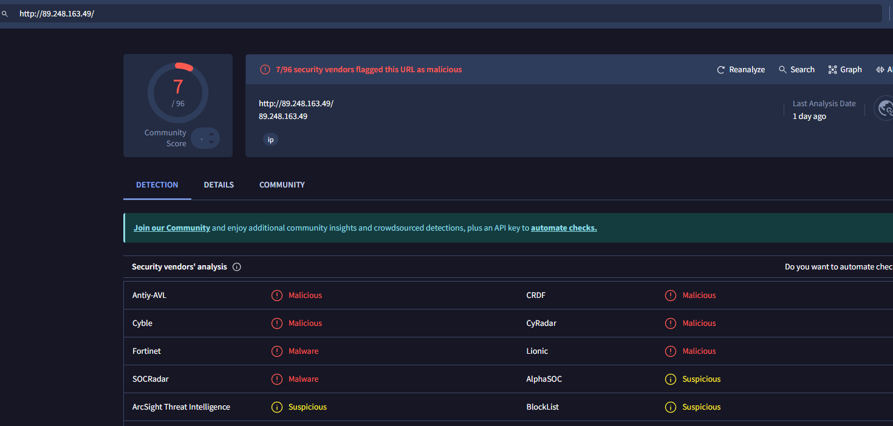
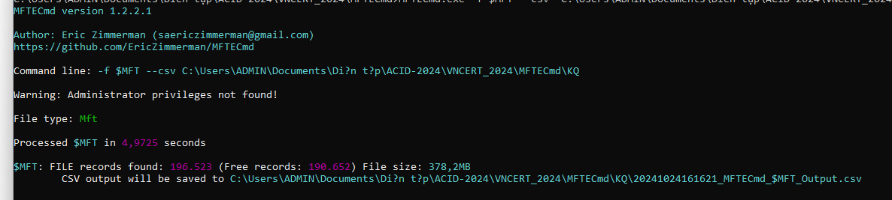
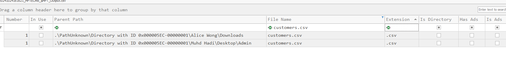
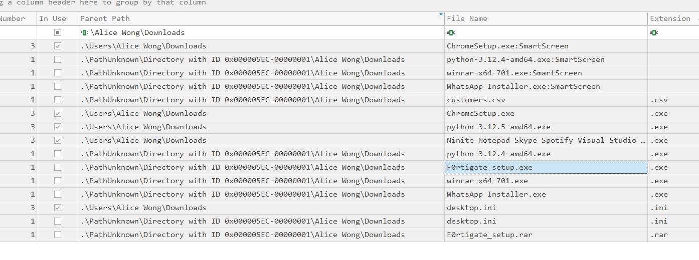

# KỊCH BẢN
Với vai trò là CERT team, chúng tôi hỗ trợ công ty AB Innovations trong việc xử lý sự cố:
```
Dear Sir/Madam,

I am Adam Lam, the CIO of AB Innovations, and would like to report an incident.

This morning, we received multiple employee reports of computer workstations demonstrating suspicious behaviour. For instance, files were moved, random progress bar for copying of files were observed and the mouse cursor was moving on its own.

We are reporting this incident as the computer workstations contain sensitive information such as personal particulars and confidential government contracts involving digitalisation projects. Moving forward, we would appreciate if your team could assist us on this matter and provide us with some containment and remediation steps to recover from this attack.

Thank you.

Best Regards,
Adam Lam
CIO, AB Innovations
```
Ngay sau khi nhận được email từ công ty, chúng tôi đã nhanh chóng đưa ra một số khuyến nghị nhằm ngăn chặn và khắc phục sự cố tạm thời.
```
Dear Mr. Lam,

Thank you for bringing this incident to our attention. We take such reports very seriously, especially given the sensitivity of the information involved.

We will initiate an immediate investigation into the suspicious behavior you’ve described. In the meantime, here are some initial containment and remediation steps you can take:

1. Isolate Affected Workstations: Disconnect any compromised workstations from the network to prevent further unauthorized access.

2. Change Passwords: Ensure that all users change their passwords immediately, especially for accounts with administrative access.

3. Run Antivirus and Anti-Malware Scans: Use updated antivirus software to scan the affected systems and remove any detected threats.

4. Document Everything: Keep a detailed log of the incidents, including timestamps and any observed anomalies.

5. Backup Important Data: If possible, create backups of critical data before proceeding with any restoration processes.

Our team will reach out shortly to coordinate further steps and provide additional support. If you have any urgent concerns, please don’t hesitate to contact me directly.

Thank you for your cooperation.

Best regards,
```
# Inject 02
```
Dear Sir/Madam,

Thank you for your email.

As requested, we have extracted the network logs related to this compromised account and attached it in this email. We seek your assistance in analysing the logs and identify any signs of data exfiltration that may have been carried out and the IP address that the information was being exfiltrated to.

Additionally, we would appreciate if you could share with us the next steps that we can take in response.

Thank you.

Best Regards,
Adam Lam
CIO, AB Innovations
```

Ta nhận được từ công 1 file pcapng. Chứa thông tin về lưu lượng mạng trong khoảng thời gian bị tấn công.

Việc phân tích lưu lượng mạng giúp ta xác định được cái gói dữ liệu được truyền đi từ các địa chỉ IP. Lưu lượng mạng bất thường, hướng đi của cuộc tấn công. Xác định được ip nguồn, ip đích, cổng nguồn cổng đích. Giao thức được sử dụng, 



Tìm kiếm lưu lượng đáng ngờ trong conversations


Ta thấy lưu lượng rất lớn, đáng ngờ đến từ địa chỉ ip 10.0.2.15 đến địa chỉ ip 89.248.163.49

Sử dụng lệnh: ip.src == 10.0.2.15 && ip.dst ==  89.248.163.49

Follow tcp: **tcp.stream eq 110**


Follow tcp: **tcp.stream eq 111**


Dựa trên bằng chứng thu thập được. Có thể thấy địa chỉ ip nội bộ **10.0.2.15** với user agent **curl/8.7.1** up file **customers.csv** đến địa chỉ ip **89.248.163.49**. Server lưu trữ file : **Werkzeug/3.0.4 Python/3.10.12**

Kiểm tra địa chỉ đáng ngờ **89.248.163.49** trên virustotal

=> địa chỉ IP này độc hại

# Inject 03
Sau khi báo cáo các thông tin thu thập được từ nhật ký mạng, công ty đã tiến hành trích xuất thêm tệp MFT để tìm kiếm thêm thông tin bổ sung về cuộc tấn công.
```
Dear Sir/Madam,

Thank you for identifying the signs of data exfiltration and the suspicious IP address. Based on our checks, that destination IP address (89.248.163.49) is not known to us for our daily operations. The source IP address (10.0.2.15) is not the machine that reported the incident. We will analyse this machine as well.

We have conducted an anti-virus scan on the initial affected system (10.0.2.6) and found no suspicious files to be flagged. While the prefetch file showed signs of tampering and file deletion, we were able to extract the Master File Table (MFT) file related to this compromised system and have attached it in this email. It was observed that the suspicious behaviours were seen after an employee downloaded a file and executed it. We seek your assistance in analysing the MFT file for the following:

Identify the locations and names of suspicious or malicious files Identify the account that is hosting the malicious file

Thank you.

Best Regards,
Adam Lam
CIO, AB Innovations
```

Ta tiến hành phân tích file MFT (Master file table). File MFT chứa thông tin chi tiết về các tệp trên hệ thống NTFS: thuộc tính của tệp, thời gian thực thi, sửa đổi, kích thước và vị trí của chúng trên ổ cứng.

Việc kết hợp phân tích Pcapng với file MFT giúp hiểu do về cuộc tấn công. Xem có các file nào được thực thi hay không. 

Sử dụng **MFTcmd** để phân tích, trích xuất csv


Tiếp theo đó sử dụng **TimelineExplorer** để trực quan hóa dữ liệu, công cụ này tổ chức dữ liệu theo dòng thời gian.

Tìm kiếm tệp customers.csv


Từ email gửi yêu cầu hỗ trợ: thông tin được cho biết là đã có nhân viên tải xuống file và thực thi tệp đó.

Đường dẫn tệp tin đáng ngờ: **\Alice Wong\Downloads**

